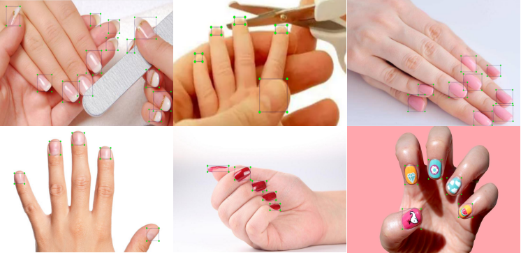
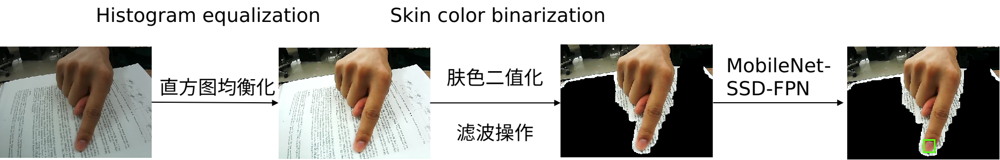
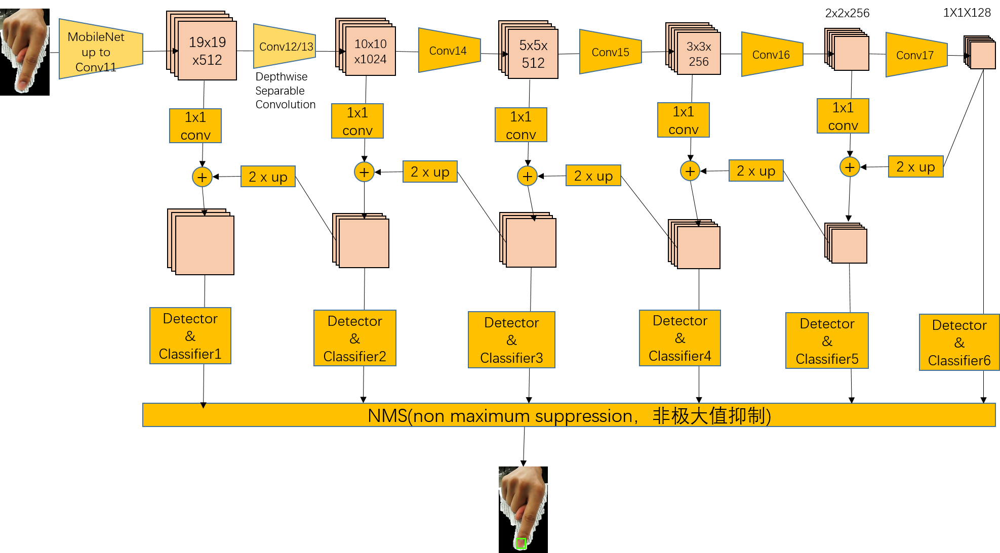
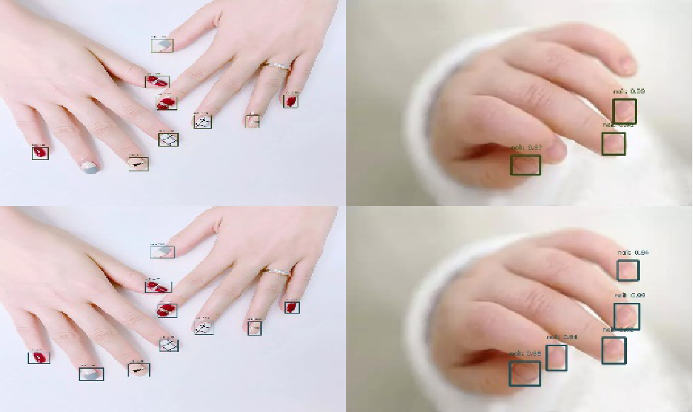

## Real-time Nail-Detection using Neural Networks (SSD) on Tensorflow.

This repo is similar to the [handtracking](<https://github.com/victordibia/handtracking>). I train the nail detector using **MobileNetV1-FPN-SSD**, and the dataset I used is annotated by laboratory member.

Here is the nail detector in action and draw the line:

The annotated samples like the below:

The overall process is divided into **3** steps:

- Histogram equalization

- Skin color binarization(convert the RGB channel to YCbCr and use inRange method to binarize)

- MobileNet-SSD-FPN

  

The **MobileNetV1-FPN-SSD** architecture may like this below:

I use the MobileNet-SSD first, but the nail is too tiny to detect. So we can see the **MobileNet-SSD-FPN** is pretty better than MobileNet-SSD.

| **Method** | **mAP** | **mAP(large)** | **mAP(medium)** | **mAP(small)** | **mAP@0.50IOU** | **mAP@0.75IOU** |
| ----------------- | ------------- | ------- | -------------- | --------------- | -------------- | ------------------- |
| MobileNet-SSD | 45.20| 62.58| 48.14| 13.14| 75.79| 45.81|
| MobileNet-SSD-FPN | 60.01| 75.03| 64.46| 29.25| 84.65| 71.85|

## To do list:

- [ ] Try a New method to implement the CVPR workshop 2019 <[Nail Polish Try-On: Realtime Semantic Segmentation of Small Objects for Native and Browser Smartphone AR Applications](<https://arxiv.org/abs/1906.02222>)>

  
